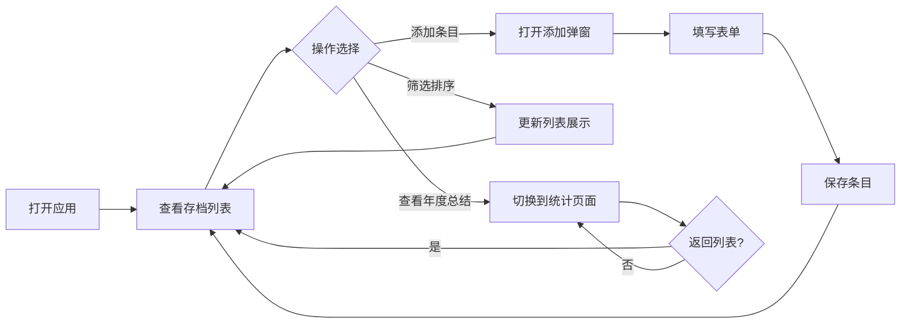

## 1. 产品概述
个人书影音存档工具，用于记录和管理用户看过的电影、读过的书、听过的专辑、玩过的游戏。
- 核心目标：为用户提供一个简洁优雅的个人文化消费记录工具，方便回顾和统计
- 目标用户：喜欢阅读、观影、听音乐、玩游戏，并希望系统记录和回顾自己体验的个人用户

## 2. 核心功能

### 2.1 用户角色
| 角色 | 注册方式 | 核心权限 |
|------|----------|----------|
| 普通用户 | 无需注册，本地存储 | 添加、编辑、删除条目；筛选和排序；查看年度总结 |

### 2.2 功能模块
1. **存档列表页**：条目卡片展示、类型筛选、年份筛选、评分排序
2. **添加/编辑条目**：表单录入名称、类型、日期、评分、简评
3. **年度总结页**：统计数量、平均分、最喜爱类型、可视化展示

### 2.3 页面详情
| 页面名称 | 模块名称 | 功能描述 |
|----------|----------|----------|
| 存档列表页 | 顶部导航 | Logo、页面切换（存档/年度总结）、添加按钮 |
| 存档列表页 | 筛选栏 | 类型筛选下拉、年份筛选下拉、评分排序按钮 |
| 存档列表页 | 条目卡片网格 | 展示所有条目，支持删除和编辑 |
| 添加/编辑弹窗 | 表单 | 名称输入、类型选择、日期选择、星级评分、简评输入 |
| 年度总结页 | 统计概览 | 年度条目总数、平均分、最喜爱类型 |
| 年度总结页 | 分类统计 | 各类型数量统计、各类型平均分 |
| 年度总结页 | 高分展示 | 年度评分最高的条目列表 |

## 3. 核心流程
用户打开应用 → 查看存档列表 → 通过筛选/排序浏览条目 → 点击添加按钮录入新条目 → 填写表单并保存 → 切换到年度总结页查看统计数据

## 4. 用户界面设计

### 4.1 设计风格
- **主色调**：深邃靛蓝色 #1e1b4b 作为主色，暖琥珀色 #f59e0b 作为强调色（星级评分）
- **辅助色**：玫瑰色 #f43f5e（电影）、翠绿色 #10b981（书籍）、天蓝色 #3b82f6（专辑）、紫罗兰色 #8b5cf6（游戏）
- **背景**：深色主题，带微妙的噪点纹理和渐变
- **按钮风格**：圆角中等，悬浮有微动效和阴影变化
- **字体**：标题使用 Playfair Display（衬线体，典雅），正文使用 Noto Sans SC（中文友好）
- **布局风格**：卡片式网格布局，顶部导航栏
- **图标风格**：Lucide 线性图标，简洁现代

### 4.2 页面设计概览
| 页面名称 | 模块名称 | UI元素 |
|----------|----------|--------|
| 存档列表页 | 顶部导航 | 深色渐变背景，品牌名，页面切换Tab，添加按钮 |
| 存档列表页 | 筛选栏 | 行内布局，筛选下拉框，排序切换按钮 |
| 存档列表页 | 条目卡片 | 彩色类型标识条、标题、日期、星级评分、简评预览、操作按钮 |
| 添加弹窗 | 表单 | 居中模态框，半透明遮罩，分组表单字段，提交和取消按钮 |
| 年度总结页 | 统计概览 | 大数字展示，卡片式统计模块，类型图标 |
| 年度总结页 | 分类统计 | 条形图可视化，各类型颜色区分 |
| 年度总结页 | 高分展示 | 排名列表，星级突出显示 |

### 4.3 响应式
- 桌面端优先设计，3列卡片网格
- 平板端自适应为2列
- 移动端单列布局，筛选栏垂直排列
- 触摸优化：增大点击区域，弹窗适配手机屏幕
