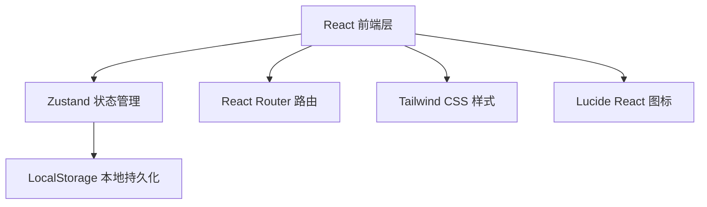
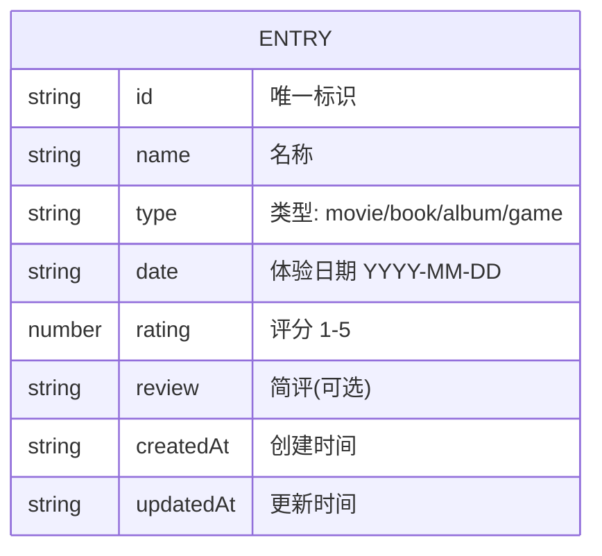

## 1. 架构设计



## 2. 技术描述
- **前端**：React@18 + TypeScript + Tailwind CSS@3 + Vite
- **初始化工具**：vite-init
- **后端**：无（纯前端应用，本地存储）
- **数据库**：LocalStorage（浏览器本地存储）
- **路由**：react-router-dom
- **状态管理**：zustand
- **图标库**：lucide-react

## 3. 路由定义
| 路由 | 用途 |
|------|------|
| / | 存档列表页（首页） |
| /summary | 年度总结页 |

## 4. 数据模型

### 4.1 数据模型定义



### 4.2 TypeScript 类型定义

```typescript
type EntryType = 'movie' | 'book' | 'album' | 'game';

interface Entry {
  id: string;
  name: string;
  type: EntryType;
  date: string;
  rating: 1 | 2 | 3 | 4 | 5;
  review?: string;
  createdAt: string;
  updatedAt: string;
}

interface FilterState {
  type: EntryType | 'all';
  year: number | 'all';
  sortBy: 'rating' | 'date';
  sortOrder: 'asc' | 'desc';
}
```

## 5. 项目文件结构

```
t:\zijie\35/
├── src/
│   ├── components/
│   │   ├── EntryCard.tsx        # 条目卡片组件
│   │   ├── EntryForm.tsx        # 添加/编辑表单组件
│   │   ├── FilterBar.tsx        # 筛选排序栏
│   │   ├── StarRating.tsx       # 星级评分组件
│   │   ├── Navbar.tsx           # 导航栏
│   │   └── Modal.tsx            # 通用弹窗组件
│   ├── pages/
│   │   ├── ArchivePage.tsx      # 存档列表页
│   │   └── SummaryPage.tsx      # 年度总结页
│   ├── store/
│   │   └── useEntryStore.ts     # Zustand 状态管理
│   ├── types/
│   │   └── index.ts             # 类型定义
│   ├── utils/
│   │   └── storage.ts           # LocalStorage 工具
│   ├── App.tsx
│   ├── main.tsx
│   └── index.css
├── index.html
├── vite.config.ts
├── tailwind.config.js
├── tsconfig.json
└── package.json
```
